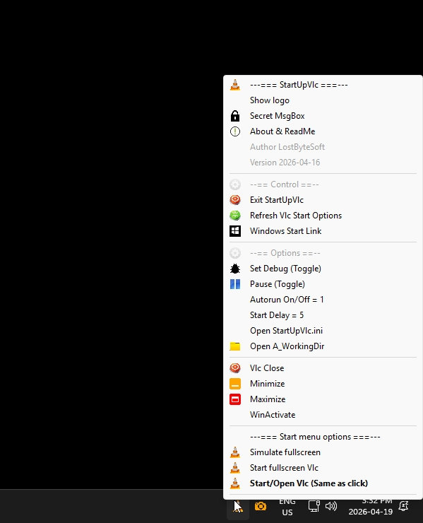

# StartUpVlc

Control Vlc at startup of the computer. Play a full screen video.

StartUpVlc, Auto start Vlc when computer start with some options.

You can change all options in file StartUpVlc.ini

First version: 2026-04-12

Copy of StartUpVlc.ini
----------------------------------------------------

[options]

;; Autorun at start : 0 or 1

autorun=1

;; debug, 0 or 1, 0 no debug msg, 1 msg

debug=0

;; Path to soft

path="C:\Program Files\VideoLAN\VLC\vlc.exe"

;; start delay in seconds : 0 to 24000
;; also used to no wait if computer is started by the number of seconds in delay

delay=5

;; minimize , maximize , donothing : 0 or 1
;; ONLY 1 CAN BE 1 ALL OTHERS MUST BY 0

maximize=0
minimize=1
donothing=0
runfullscreen=0

;; You can start a fullscreen with this video file on startup.
;; Change runfullscreen to 1 (all others to 0)
;; Autorun set to 1
;; autoplayvideo set to 1 , video will play at startup of the computer.
;; Need full path for the video.
autoplayvideo=0
video="C:\Windows\WinSxS\amd64_microsoft-windows-c..st.appxmain.desktop_31bf3856ad364e35_10.0.26100.1591_none_24d501a973fa7371\oobe-intro.mp4"

;;--- Read me file ---
;
;            DO WHAT THE FUCK YOU WANT TO PUBLIC LICENSE
;   Version 3.14159265358979323846264338327950288419716939937510582
;                          March 2017
;
; Everyone is permitted to copy and distribute verbatim or modified
; copies of this license document, and changing it is allowed as long
; as the name is changed.
;
;            DO WHAT THE FUCK YOU WANT TO PUBLIC LICENSE
;   TERMS AND CONDITIONS FOR COPYING, DISTRIBUTION AND MODIFICATION
;
;              You just DO WHAT THE FUCK YOU WANT TO.
;
;		     NO FUCKING WARRANTY AT ALL
;
;	As is customary and in compliance with current global and
;	interplanetary regulations, the author of these pages disclaims
;	all liability for the consequences of the advice given here,
;	in particular in the event of partial or total destruction of
;	the material, Loss of rights to the manufacturer's warranty,
;	electrocution, drowning, divorce, civil war, the effects of
;	radiation due to atomic fission, unexpected tax recalls or
;	    encounters with extraterrestrial beings 'elsewhere.
;
;              LostByteSoft no copyright or copyleft.
;
;	If you are unhappy with this software i do not care.
;
;;--- End of file ---
